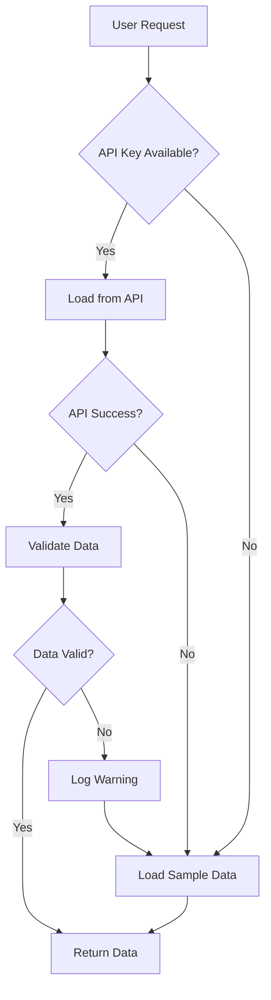
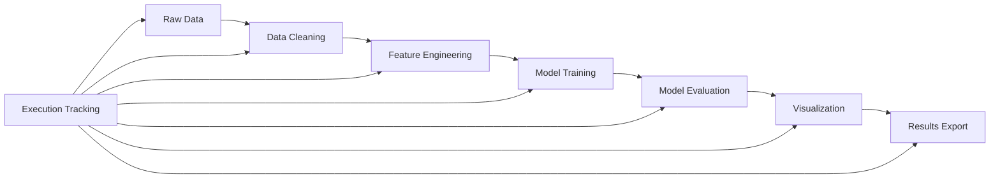

# System Architecture

This document provides an overview of the KRAnalytics framework design, component interactions, and architectural principles.

## 🏗️ Architecture Overview

KRAnalytics follows a modular, layered architecture designed for scalability, maintainability, and ease of use.

```
┌─────────────────────────────────────────────────────────────┐
│                    User Interface Layer                     │
├─────────────────────────────────────────────────────────────┤
│  Jupyter Notebooks  │  Scripts  │  Interactive Dashboards  │
└─────────────────────────────────────────────────────────────┘
                               │
┌─────────────────────────────────────────────────────────────┐
│                   Analysis Layer                            │
├─────────────────────────────────────────────────────────────┤
│  ML Pipelines  │  Statistical Models  │  Visualization     │
└─────────────────────────────────────────────────────────────┘
                               │
┌─────────────────────────────────────────────────────────────┐
│                    Core Framework                           │
├─────────────────────────────────────────────────────────────┤
│  Data Utils  │  Execution Tracking  │  Configuration      │
└─────────────────────────────────────────────────────────────┘
                               │
┌─────────────────────────────────────────────────────────────┐
│                   Data Layer                                │
├─────────────────────────────────────────────────────────────┤
│  API Clients  │  Data Validation  │  Caching  │  Fallbacks │
└─────────────────────────────────────────────────────────────┘
                               │
┌─────────────────────────────────────────────────────────────┐
│                External Data Sources                        │
├─────────────────────────────────────────────────────────────┤
│  Census API  │  BLS API  │  FRED API  │  Local Files       │
└─────────────────────────────────────────────────────────────┘
```

## 📦 Core Components

### 1. Data Management (`kranalytics.data_utils`)

**Purpose**: Unified interface for data loading with fallback mechanisms

**Key Features**:
- API key management and secure credential loading
- Automatic fallback to sample data when APIs are unavailable
- Data validation and quality checks
- Caching for improved performance

**Main Classes**:
```python
# Core data loading functions
load_data_with_fallback()    # Smart API + fallback loading
load_sample_data()           # Sample data loader
get_api_key()               # Secure credential management
save_sample_data()          # Sample data creation
```

### 2. Execution Tracking (`kranalytics.khipu_analytics.execution_tracking`)

**Purpose**: Comprehensive provenance and reproducibility tracking

**Key Features**:
- Unique execution ID generation
- Environment metadata capture
- Execution timing and performance metrics
- JSON-based execution logs

**Main Classes**:
```python
setup_notebook_tracking()     # Initialize execution tracking
finalize_notebook_tracking()  # Complete execution record
get_execution_summary()       # Retrieve execution details
list_recent_executions()      # Browse execution history
```

## 🔄 Data Flow Architecture

### 1. Data Ingestion Flow



### 2. Analysis Pipeline



## 🎯 Design Principles

### 1. Graceful Degradation

**Problem**: API keys may not be available in all environments
**Solution**: Automatic fallback to sample data ensures notebooks always run

```python
# Example: Always works, regardless of API availability
df = load_data_with_fallback(
    api_loader_func=load_census_data,
    dataset_name='census_income_2022',
    api_key_name='CENSUS_API_KEY'
)
```

### 2. Reproducibility by Design

**Problem**: Analysis results must be reproducible across environments
**Solution**: Comprehensive execution tracking and seed management

```python
# Example: Full provenance tracking
metadata = setup_notebook_tracking(
    notebook_name="Income_Analysis.ipynb",
    seed=42,  # Ensures reproducible results
    save_log=True  # Comprehensive logging
)
```

### 3. Security First

**Problem**: API credentials must be protected
**Solution**: Environment-based credential management, never hardcoded

```python
# Example: Secure credential loading
api_key = get_api_key('CENSUS_API_KEY', required=False)
if not api_key:
    print("Using sample data (no API key required)")
```

### 4. Modularity and Extensibility

**Problem**: Framework must support diverse use cases
**Solution**: Modular design with clear interfaces

```python
# Example: Easy to extend with new data sources
def load_new_api_data(api_key, **kwargs):
    # Custom API implementation
    pass

# Automatically gets fallback capability
df = load_data_with_fallback(
    api_loader_func=load_new_api_data,
    dataset_name='new_api_sample',
    api_key_name='NEW_API_KEY'
)
```

## 🗂️ File Organization

### Package Structure

```
src/kranalytics/
├── __init__.py                 # Package initialization and exports
├── data_utils.py              # Core data loading utilities
└── khipu_analytics/
    ├── __init__.py
    └── execution_tracking.py   # Provenance and tracking
```

### Configuration Management

```
config/
├── api_keys.env              # API credentials (git-ignored)
├── defaults.json             # Default configuration
└── data_sources.json         # Data source definitions
```

### Data Organization

```
data/
├── sample_datasets/          # Fallback sample data
│   ├── census_income_2022.csv
│   ├── bls_employment_*.csv
│   └── MANIFEST.json         # Dataset metadata
├── cache/                    # API response cache
└── outputs/                  # Analysis results
```

### Logging and Tracking

```
logs/
├── execution/               # Notebook execution logs
│   ├── exec_20251014_*.json
│   └── summary.json
├── api/                     # API call logs
└── errors/                  # Error logs
```

## ⚡ Performance Considerations

### 1. Caching Strategy

- **API Responses**: Cache successful API calls to reduce redundant requests
- **Processed Data**: Cache cleaned and transformed datasets
- **Model Results**: Cache trained models for reuse

### 2. Memory Management

- **Lazy Loading**: Load data only when needed
- **Chunked Processing**: Handle large datasets in chunks
- **Garbage Collection**: Explicit cleanup of large objects

### 3. Scalability Patterns

- **Sampling**: Intelligent sampling for large datasets
- **Parallel Processing**: Multi-core utilization where appropriate
- **Async Operations**: Non-blocking API calls

## 🔒 Security Architecture

### 1. Credential Management

```python
# Secure credential hierarchy
1. Environment variables (highest priority)
2. User configuration files (local only)
3. Default sample data (fallback)
```

### 2. Data Protection

- **No Sensitive Data**: Sample datasets contain only public information
- **API Rate Limiting**: Respect provider rate limits
- **Error Handling**: Avoid exposing sensitive information in logs

### 3. Audit Trail

- **Execution Logs**: Complete record of what was run and when
- **Data Lineage**: Track data sources and transformations
- **Version Control**: Clear versioning of notebooks and code

## 🧪 Testing Architecture

### 1. Unit Tests

```python
# Test core functionality
tests/unit/
├── test_data_utils.py        # Data loading tests
├── test_execution_tracking.py # Tracking tests
└── test_api_clients.py       # API client tests
```

### 2. Integration Tests

```python
# Test end-to-end workflows
tests/integration/
├── test_notebook_execution.py  # Full notebook runs
├── test_api_integration.py     # Real API calls
└── test_data_pipeline.py       # Complete data flows
```

### 3. Sample Data Tests

```python
# Ensure sample data works
tests/sample_data/
├── test_sample_completeness.py # All samples present
├── test_data_quality.py        # Data quality checks
└── test_fallback_behavior.py   # Fallback mechanisms
```

## 🚀 Deployment Patterns

### 1. Local Development

```bash
# Quick setup for development
git clone https://github.com/KR-Labs/KRAnalytics.git
cd KRAnalytics
make install-dev
```

### 2. Production Environment

```bash
# Production installation
pip install kranalytics[ml,viz]
export CENSUS_API_KEY="your_key"
export BLS_API_KEY="your_key"
```

### 3. Educational/Demo Environment

```bash
# No API keys required - uses sample data
pip install kranalytics
# Run notebooks immediately with sample data
```

## 📈 Monitoring and Observability

### 1. Execution Metrics

- **Runtime Performance**: Track notebook execution times
- **Data Quality**: Monitor data validation results
- **API Health**: Track API response times and errors

### 2. Usage Analytics

- **Popular Notebooks**: Track which examples are most used
- **Error Patterns**: Identify common failure points
- **Performance Bottlenecks**: Find optimization opportunities

## 🔮 Future Architecture Considerations

### 1. Distributed Computing

- **Dask Integration**: Scale to larger datasets
- **Cloud Computing**: Deploy on AWS, Azure, GCP
- **Container Support**: Docker and Kubernetes deployment

### 2. Real-time Capabilities

- **Streaming Data**: Support real-time data sources
- **Live Dashboards**: Real-time visualization updates
- **Event-driven Architecture**: React to data updates

### 3. ML Operations (MLOps)

- **Model Registry**: Track and version trained models
- **Automated Retraining**: Update models with new data
- **Model Serving**: Deploy models as APIs

---

**Last Updated:** October 14, 2025  
**Version:** v1.0.0